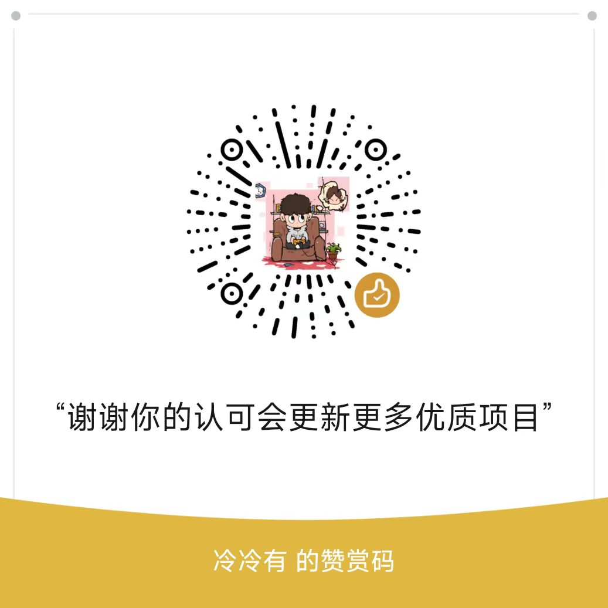

# 三角洲护航小程序

#### 介绍

三角洲护航平台，使用 Spring Boot + Vue + UniApp 开发，支持微信小程序，支持唤起微信支付。

技术栈：**Spring Boot**、**Vue 3**、**UniApp**、**微信小程序**、**微信支付**。

> **说明**：因闲鱼等平台有人倒卖源码，本仓库仅提供打包后的代码，暂不放出完整源码。若您是开发者，希望获取源码进行二次开发，请通过 **QQ：2104924410** 联系并说明来意。

#### 演示视频

| 端 | 演示地址 |
|----|----------|
| 小程序演示 | [点击观看](https://furandianjing.cn/file/1.mp4) |
| PC 端演示 | [点击观看](https://furandianjing.cn/file/2.mp4) |

#### 功能说明

三角洲护航点单成品微信小程序，适用于俱乐部、和平精英、暗区突围、英雄联盟等护航陪玩场景。

**端结构**
- 原生微信小程序 + PC 后台
- PC 端：管理员 + 多客服管理
- 小程序端：用户端 + 接单端（打手端）+ 客服端

**核心功能**
- **微信支付**：支持唤起微信支付，立即到账
- **手机客服**：客服可直接登录小程序，在手机上派单、回复、引导下单
- **多种派单方式**：客服派单、自动派单、指定单、抢单、组队单
- **闭环流程**：下单 → 派单 → 接单 → 进度 → 完成 → 评价/投诉
- **自定义抽佣比例**：0%～50% 多种比例可调，立即生效
- **富消息**：聊天可发订单卡片、商品卡片
- **订阅通知**：客户微信内可收到被接单、服务完成等提醒

系统已部署线上，已通过微信小程序代码审核，稳定运营，合规使用。

#### 仓库内容

| 文件/目录 | 说明 |
|----------|------|
| `dist/` | PC 管理后台前端（Nginx 部署） |
| `mp-weixin/` | 微信小程序代码（微信开发者工具上传） |
| `delta-admin.jar` | 后端服务打包 Jar |
| `delta_game.sql` | 数据库初始化脚本 |
| `*.html` | 部署与配置文档 |

#### 下载打包交付物（推荐方式）

为方便部署，这里提供的是**整个项目的打包压缩包**（包含 `delta-admin.jar`、`dist/`、`mp-weixin/`、文档等交付物），请从下面地址下载：

**👉 [点击下载打包项目压缩包](https://wwatd.lanzouu.com/iCDqc3k6rqud)**

#### 部署说明

1. 详见仓库内 **部署文档.html**（服务器部署、Nginx 配置、Java 启动）
2. **服务器搭建.html**：购买服务器、域名、SSL 证书
3. **小程序AppID与商户密钥获取.html**：微信 AppID、商户号、支付密钥、订阅消息

#### 安装教程

1. 克隆本仓库（或直接下载上方「打包项目压缩包」并解压）
2. 将 `delta-admin.jar` 上传到服务器（如 `/www/wwwroot/delta-admin.jar`）
3. 按 **部署文档.html** 完成服务器环境、Nginx、MySQL、Redis 配置
4. 使用微信开发者工具打开 `mp-weixin` 目录，配置域名后上传小程序

#### 赞赏

如果本项目对您有帮助，欢迎扫码赞赏支持作者持续更新～

#### 参与贡献

1. Fork 本仓库
2. 新建 Feat_xxx 分支
3. 提交代码
4. 新建 Pull Request
